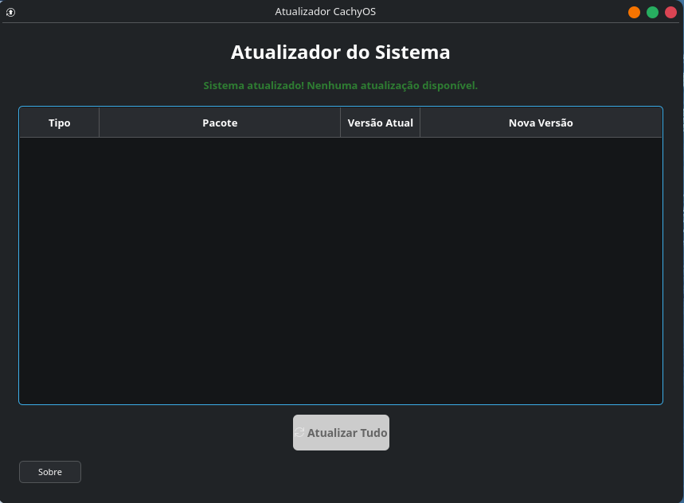

<div align="center">

# ⚡ Atualizador CachyOS

**Interface gr\u00E1fica simples para manter seu CachyOS e Flatpak sempre atualizados**


---

</div>

## \u00CDndice

- [Sobre](#sobre)
- [Funcionalidades](#funcionalidades)
- [Captura de Tela](#captura-de-tela)
- [Instala\u00E7\u00E3o](#instala\u00E7\u00E3o)
  - [M\u00E9todo 1 — Script Autom\u00E1tico (recomendado)](#m\u00E9todo-1--script-autom\u00E1tico-recomendado)
  - [M\u00E9todo 2 — PKGBUILD](#m\u00E9todo-2--pkgbuild)
  - [M\u00E9todo 3 — Manual](#m\u00E9todo-3--manual)
- [Como Usar](#como-usar)
- [Compilar do Zero](#compilar-do-zero)
- [Licen\u00E7a](#licen\u00E7a)

---

## Sobre

O **Atualizador CachyOS** \u00E9 um programa com interface gr\u00E1fica feita para o KDE que permite atualizar o sistema CachyOS e os aplicativos Flatpak com apenas um clique.

Feito para **iniciantes** e **usu\u00E1rios avan\u00E7ados** que preferem uma interface visual ao inv\u00E9s do terminal.

> C\u00F3digo 100% livre e aberto. Sinta-se \u00E0 vontade para modificar, estudar e compartilhar.

---

## Funcionalidades

- **Verifica\u00E7\u00E3o autom\u00E1tica** ao abrir o programa
- **Lista organizada** com nome do pacote, vers\u00E3o atual e nova vers\u00E3o
- **Atualiza\u00E7\u00E3o completa** do sistema (`pacman -Syu`)
- **Atualiza\u00E7\u00E3o de Flatpaks** (`flatpak update`)
- **Bot\u00E3o \u00FAnico** "Atualizar Tudo" para fazer ambos de uma vez
- **Interface nativa**, combina perfeitamente com o KDE Plasma
- **Leve e r\u00E1pido** — compilado em C++ com Qt6
- **Re-verifica\u00E7\u00E3o autom\u00E1tica** ap\u00F3s concluir as atualiza\u00E7\u00F5es

---

## Captura de Tela

<div align="center">




</div>

---

## Instala\u00E7\u00E3o

### M\u00E9todo 1 — Script Autom\u00E1tico (recomendado)

Para usu\u00E1rios iniciantes, o jeito mais f\u00E1cil:

```bash
git clone https://github.com/ailton-0041/update-cachyOS.git
cd update-cachyOS
chmod +x install.sh
./install.sh
```

O script instala todas as depend\u00EAncias, compila e configura o programa no sistema automaticamente.

### M\u00E9todo 2 — PKGBUILD

Para usu\u00E1rios que preferem o modo Arch Linux nativo:

```bash
git clone https://github.com/ailton-0041/update-cachyOS.git
cd update-cachyOS
makepkg -si
```

### M\u00E9todo 3 — Manual

```bash
# Depend\u00EAncias
sudo pacman -S --needed qt6-base flatpak polkit cmake gcc make

# Compilar
git clone https://github.com/ailton-0041/update-cachyOS.git
cd update-cachyOS
mkdir -p build && cmake -B build -DCMAKE_BUILD_TYPE=Release
cmake --build build

# Instalar
sudo install -Dm755 build/AtualizadorCachyOS /usr/local/bin/update-cachyos
sudo install -Dm644 resources/update-cachyos.desktop /usr/local/share/applications/
sudo update-desktop-database /usr/local/share/applications
```

Ap\u00F3s a instala\u00E7\u00E3o, o programa aparece no **Menu KDE** como **Atualizador CachyOS**.

---

## Como Usar

1. Abra o programa pelo menu KDE ou execute `update-cachyos` no terminal
2. Ele j\u00E1 vai procurar atualiza\u00E7\u00F5es automaticamente
3. Se houver atualiza\u00E7\u00F5es, clique em **Atualizar Tudo**
4. Digite sua senha (solicita\u00E7\u00E3o do `pkexec`)
5. Pronto! O sistema ser\u00E1 re-verificado ap\u00F3s a conclus\u00E3o

---

## Compilar do Zero

Se quiser compilar manualmente sem instalar:

```bash
cmake -B build -DCMAKE_BUILD_TYPE=Release
cmake --build build
./build/AtualizadorCachyOS
```

**Requisitos:**
- Compilador C++ (gcc ou clang)
- CMake ≥ 3.16
- Qt6 (Widgets)
- Flatpak (para detectar e atualizar Flatpaks)
- Polkit (pkexec) — Pr\u00E9-instalado no CachyOS

---

## Licen\u00E7a

Este projeto \u00E9 **c\u00F3digo livre** — distribu\u00EDdo sob a licen\u00E7a **MIT**.

Voc\u00EA pode usar, copiar, modificar, mesclar, publicar, distribuir e at\u00E9 vender c\u00F3pias do software, desde que mantenha o aviso de direitos autorais.

---

<div align="center">

Criado por [Ailton](https://github.com/ailton-0041) &nbsp;|&nbsp; [Atualizador CachyOS](https://github.com/ailton-0041/update-cachyOS)

</div>
